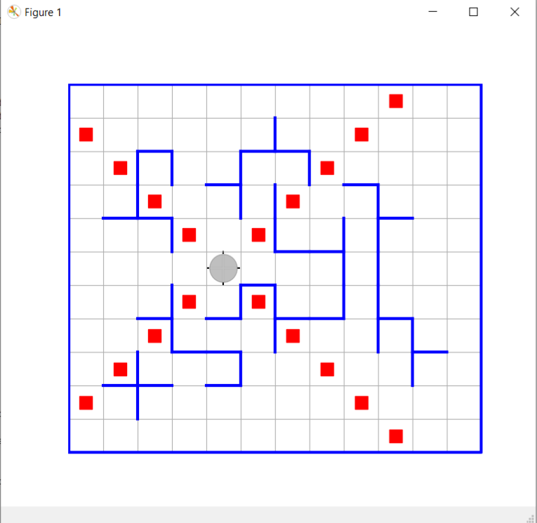

# РОБОТ НА КЛЕТЧАТОМ ПОЛЕ СО СТОРОНАМИ ГОРИЗОНТА

Данное ПО предназначено для поддержки начального курса программирования для студентов-первокурсников, целью которого является научить писать хорошо структурированный программный код, основываясь на технологии проектирования сверху вниз и включая использование идей обобщенного программирования. Оно помогает легко формулировать учебные задачи, сложность которых можно варьировать в достаточно широких пределах, и на которых можно научить (научиться) всему заявленному, по крайней мере, в некотором приближении.

Лежащие в основе методические идеи восходят к учебнику Кушниренко А.Г. и Лебедева Г.В. «Программирование для математиков», 1988.

Курс базируется на языке программирования Julia. Этот язык очень выразительный, прост в изучении, обладает ясным и удобным синтаксисом, развитой системой типов, поддерживает основные на сегодняшний день парадигмы программирования, обладает хорошими интерактивными возможностями, динамически компилируемый, удачно спроектирован как для требовательных математических и технических применений, так и для общего программирования. [Официальный сайт](https://julialang.org/).

-----------------------------------------------
## Содержание

* [Подготовка окружения к работе](setup.md)
* [Подключение и командный интерфейс Робота](api.md) 
* [Вводные замечания о программировании на языке Julia](language.md)
* [Пример решения задачи](example.md)
* [Дополнительные источники информации о языке Julia](links.md)

